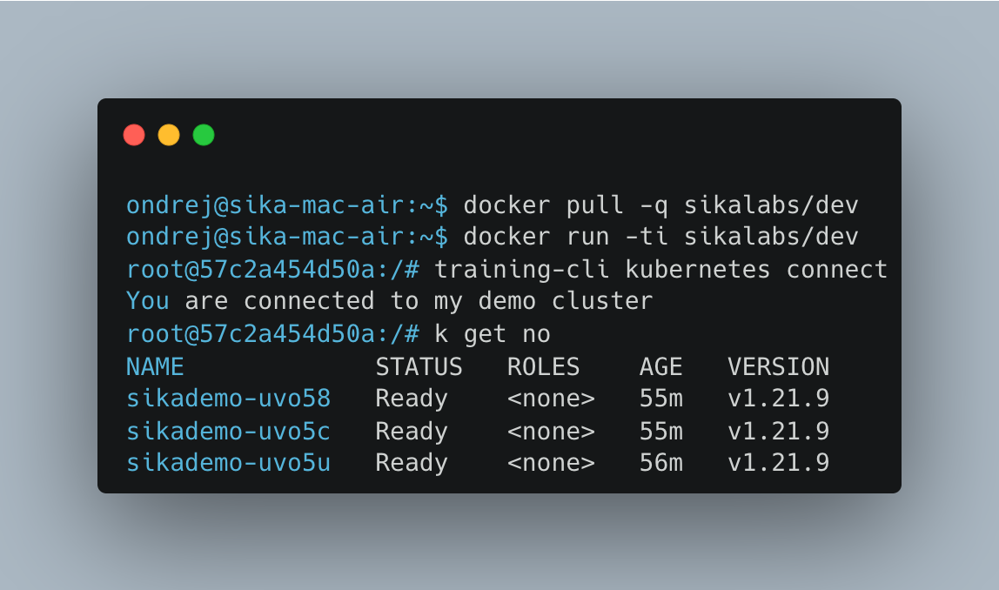

<p align="center">
  <h1 align="center">training-cli</h1>
  <p align="center">
    <a href="https://sika.io"></a>
    <a href="https://sika.io"></a>
    <a href="mailto:ondrej@sika.io"></a>
  </p>
</p>

## Example Usage



## Install

## Install Mac

```
brew install ondrejsika/tap/training-cli
```

## Install Windows

Using **scoop**

```
scoop install https://raw.githubusercontent.com/ondrejsika/scoop-bucket/master/training-cli.json
```

## Install using `slu` (Linux, Mac)

```
slu install-bin-tool training-cli
```
